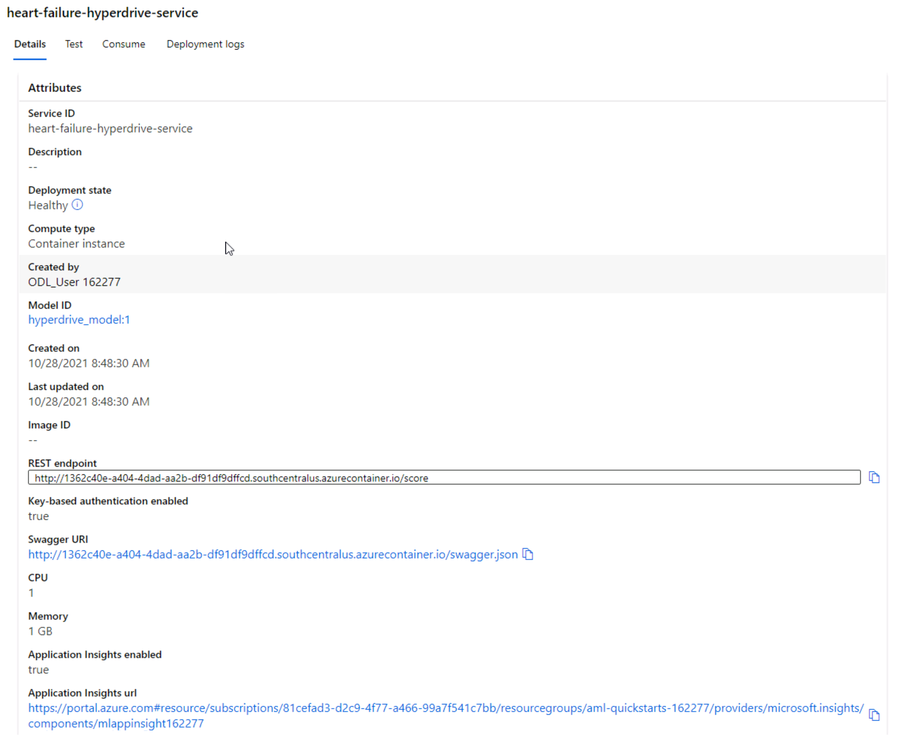
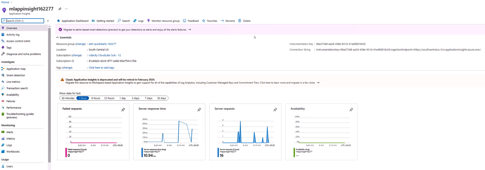

# Machine Learning Engineer with Microsoft Azure Capstone Project: <br> :heart: Predicting Heart Failure :broken_heart:

> Cardiovascular diseases (CVDs) are the leading cause of death globally.
> An estimated 17.9 million people died from CVDs in 2019, representing 32% of all global deaths. Of these deaths, 85% were due to heart attack and stroke.
> It is important to detect cardiovascular disease as early as possible so that management with counselling and medicines can begin.
> <br> [WHO fact sheet on cardiovascular diseases](https://www.who.int/en/news-room/fact-sheets/detail/cardiovascular-diseases-(cvds)) Retrieved: 2021-10-28

Due to the large impact of CVD I am using this capstone project to train a machine learning model to help doctors diagnose patients with CVD. This should be achieved, while using only a small set of diagnostic data, which can be easily obtained by a medical professional. Early detection and treatment of a CVD is highly favorable for the survival of the patients.

To tackle this task, I'm using the free heart-failure-prediction dataset from [kaggle.com](http://www.kaggle.com/) (see section [Dataset](#dataset)). I'm using two approaches to train a model: On the one hand I use the automated machine learning feature from Azure called AutoML (see section [Automated ML](#automated-ml)), which trains many different model types on the dataset. On the other hand I use the AzureML HyperDrive package to automatically tune hyperparameters of a RandomForestClassifier model (see section [Hyperparameter Tuning](#hyperparameter-tuning)). I then deploy the best model to a WebService and interact with it (see section [Model Deployment](#model-deployment)). Additionally I'm giving a short excursion on how to convert the model into the ONNX-framework and on how to monitor the deployed endpoint using logging (see section [Standout Suggestions](#standout-suggestions)).

## Project Set Up and Installation


This project consists of two jupyter notebooks [automl.ipynb](automl.ipynb) and [hyperparameter_training.ipynb](hyperparameter_training.ipynb), one python file [train.py](train.py) containing functions to clean and read in the data, as well as the training algorithm for the model to be used in the HyperDrive experiment and the folder [data/](data/) containing the dataset in .csv format.
In order to run both notebooks, the whole project folder, including the subfolder data has to be uploaded into the Azure Machine Learning Studio Notebook section.

The notebook section should look like this ➡️

Please make sure to adjust the `subscription_id`,`ressource_group` and `workspace_name` in the [config.json](./config.json) according to your subscription

## Dataset

### Overview
The dataset I'm using for this project is the Heart Failure Prediction Dataset from kaggle.

fedesoriano. (September 2021). Heart Failure Prediction Dataset. Retrieved [2021-10-18] from https://www.kaggle.com/fedesoriano/heart-failure-prediction.

I chose this dataset, since it is a quite comprehensive and balanced dataset, with features that are mostly comprehensible for non-professionals too.

### Task

The task with this dataset is to predict whether a person will develop a heart disease with a set of 11 diagnostic features.
This dataset is a combination of five independent heart disease datasets containing 918 observations of patients. The target column "Heart Disease" is nearly balanced in this dataset with 510 patients with and 408 patients without cardiovascular diseases.

The features in this dataset are:
- General information
  - Age of the patient in years; with the youngest patient being 28 and the oldest 77 years old
  - Sex of the patient; the majority of the patients (79%) being male
- blood tests
  - Cholesterol in serum [mm/dl]; an indicator for ateriosclerosis
  - fasting blood sugar level; a boolean value if the blood sugar is elevated (>120mg/dl) or not, which is an indicator for diabetes
- medical history
  - type of chest pain the patient is experiencing in four categories (TA: typical angina, ATA: atypical angina, NAP: non-anginal pain, ASY: asymptomatic)
- ECG and cardiac stress testing <br> For reference I linked a picture of a normal heart rythm in an ECG from [wikipedia](https://en.wikipedia.org/wiki/File:SinusRhythmLabels.svg#filelinks) ➡️
  [](https://en.wikipedia.org/wiki/File:SinusRhythmLabels.svg#filelinks)

  - resting blood pressure [mm Hg]
  - resting ECG results in three categories (Normal,  ST: ST-T wave abnormality, LVH : left ventricular hypertrophy)
  - oldpeak: the depression between S and T peak in the ECG
  - maximum heartrate under cardiac stress
  - exercise-induced angina
  - ST-slope in the ECG of the peak exercise in three categories (up, flat and down) 

### Access
Since I'm using the same dataset for an AutoML run and a HyperDrive Experiment, I defined the access to the data in the function `read_data()` in the [train.py](train.py) script, so it can be used in both notebooks.

To be used in the Azure Machine Learning Studio the data has to be uploaded and registered in the Workspace. The dataset will be available by the name "heart_disease_data". First the function `read_data()` checks, whether a dataset of this name is already registered in the workspace `ws` with `ws.datasets["heart_diseases_data"]`. If it is found, then the function will reuse this dataset.

If the dataset is not found, the function first accesses the default datastore of the workspace, and uploads the contents of the data folder into a folder named "data" in the datastore
```
datastore = ws.get_default_datastore()
datastore.upload('./data', overwrite=True, target_path='data')
```
Then a Tabular Dataset is created using `from_delimited_files()`. I could already register this dataset, but I want to use my own preprocessing algorithm to clean the data, therefore I call the function `prepare_data()` (see [section PreProcessing](#preprocessing)).
The output of this function is a cleaned and ready to use pandas dataframe. I register this dataframe as `TabularData` in my workspace with the name "heart_disease_data".
```
dataset = Dataset.Tabular.register_pandas_dataframe(df, datastore, show_progress=True,
                             name="heart_disease_data", description=description_text)
```

### PreProcessing
The preprocessing of the data is defined in the `prepare_data` function in the [train.py](train.py) script.
Some categorical features have to be preprocessed before they can be handled by the machine learning models.
- The columns Sex and ExerciseAngina are binary coded, with 1 for "male"/"yes" and 0 for "female"/"no" respectively.
- The column ST_Slope is numerically encoded with 1 for "Up", 0 for "Flat" and -1 for "Down".
- The columns for the ChestPainType and RestingECG features are one_hot encoded for the model.

## Automated ML
For a detailed description of the AutoML configuration please refer to the incode documentation in [automl.ipynb](automl.ipynb).<br>
I'm running a classification task on the dataset without featurization using a 5-fold crossvalidation and the primary metric accuracy.

### Results
You can find an overview and discussion about the models trained by the AutoML run and a detailed description of the best model of this run in [automl.ipynb](automl.ipynb).<br>
The best model of the AutoML run is a VotingEnsemble containing the tree-based-models XGBoostClassifier and LightGBM. It has an accuracy of `0.889` and a precision of `0.892`.


A description on further improvements can also be found in the [notebook](automl.ipynb).

## Hyperparameter Tuning
For a detailed description of the hyperdrive configuration please refer to the incode documentation in [hyperparameter_tuning.ipynb](hyperparameter_tuning.ipynb). <br>
I chose a RandomForestClassifier model for this problem, since the input data is a mix of categorical und numerical data on which tree-based models tend to perform well. The HyperDrive Run tunes three parameters of this model on the primary metric accuracy: 
- the number of trees in the forest: here the tuning algorithm will use random integers up to 10000. A too small number of trees mean, that some observations might not be predicted by any of the trees in the forest.
- the maximum depth of a tree: the depth of the trees will be chosen from [10,100,1000,5000]. A deeper tree, meaning more splits and more leafs.
- the minimum number of samples required to split a node in the tree: this will be a random integer up to 50. The lower the number, the deeper a tree can get.

The model training is defined in [train.py](train.py). Please note, that I log more than the primary metric of this model for each run. I convert the trained models into ONNX-Framework as well (see section [Standout Suggestions](#standout-suggestions)). 

### Results
You can find an overview and discussion about the models trained by the Hyperparameter tuning and a detailed description of the best model of this run in [hyperparameter_tuning.ipynb](hyperparameter_tuning.ipynb). <br>
The best RandomForestClassifier model of this run consists of 1416 trees with a maximum depth of 100 and at least 2 samples inside one leaf. It has an accuracy of `0.922` and a precision of `0.896`.


A description on further improvements can also be found in the [notebook](hyperparameter_tuning.ipynb).

## Model Deployment


I deployed the best model from the Hyperparameter tuning, since it had a better accuracy than the Voting Ensemble from the AutoML run.
I deployed the model in the ONNX-Framework using the `onnxruntime.InferenceSession` class. You can find detailed description of the deployment process in the incode documentation in the [hyperparameter_tuning.ipynb](hyperparameter_tuning.ipynb) notebook as well as in the section [Deploying Models in ONNX-Framework](#deploying-models-in-onnx-framework).

After finishing my screencast, I deployed the AutoML model as well, this time using the saved `pkl` file. You can find a detailed description of this deployment in the [automl.ipynb](automl.ipynb) notebook.

I provided an example on how to query the endpoint in both notebooks. Please note that due to the differences in deployment (see section [Deploying Models in ONNX-Framework](#deploying-models-in-onnx-framework)) the query for both endpoints differs slightly. The endpoint with the HyperDrive model expects a json with the key `Inputs`, the AutoML endpoint expects a json with the keys `data` and `method`. Since this could be quite confusing, I provided for both endpoints a swagger documention of the API, that can found in the `swagger\` folder in the respective model folders. In both notebooks you can find a screenshot of the SwaggerUI for the respective endpoint.

## Screen Recording
A screencast of the deployed hyperdrive model can be found here: https://youtu.be/t1e8SQdtGYY

## Standout Suggestions
### Converting the Models into ONNX-Framework
The conversion of the model into ONNX-Framework is straightforward when using the AutoML feature of Azure. You simply enable the onnx compatible models in the AutoMLConfig with 
```
enable_onnx_compatible_models=True
```
After the run finished, a `model.onnx` is saved next to the `model.pkl` in the `outputs\` folder and can be downloaded.

For the models in the HyperDrive run I chose to use the `skl2onnx` package and directly convert the sklearn model during the run. I defined the conversion in the [train.py](train.py) script line 140ff. First I have to convert the input into the model to a datatype the ONNX-Framework can handle. This is important to remember, when deploying the model (see section [Deploying Models in ONNX-Framework](#deploying-models-in-onnx-framework)). I then save the model in the folder `outputs` with the name `hyperdrive_model.onnx` for each run.
```
initial_type = [('X', FloatTensorType([None, x_train.shape[1]]))]
onnx = convert_sklearn(model, initial_types=initial_type)
with open('outputs/hyperdrive_model.onnx', "wb") as f:
       f.write(onnx.SerializeToString())
```
### Deploying Models in ONNX-Framework
Deploying a model from the AutoML is straightforward (see [automl.ipynb](automl.ipynb)), since a [scoring script](automl_model/scoring_file_v_1_0_0.py) and an [environment definition](/automl_model/conda_env_v_1_0_0.yml) for the model is created during the run that can be used for deployment. But for the ONNX-model from the HyperDrive run I had to provide the scoring script [score_onnx_model_version2.py](hyperdrive_model/score_onnx_model_version2.py) and the [environment script](hyperdrive_model/hyperdrive_env.yml) myself.
#### Scoring script for the ONNX-Framework
The scoring script needs an `init()` funtion to load the model into the WebService. In the `init()` function I load the saved ONNX-model and invoke an `onnxruntime.InferenceSession`.
```
model = os.path.join(os.getenv('AZUREML_MODEL_DIR'), 'hyperdrive_model.onnx')
session = onnxruntime.InferenceSession(model, None)
```
For an automated generation of a swagger file, I have to use the decorator functions `input_schema` and `output_schema` of the `inference_schema` package. I provided a pandas Dataframe of the same shape as my training data as an input sample. I tried to use an input_schema similar to the AutoML model with an `{"data": [], "method": str}` input. But
according to the [documentation](https://docs.microsoft.com/en-us/azure/machine-learning/how-to-deploy-advanced-entry-script#automatically-generate-a-swagger-schema) the automated swagger generation only handles an input schema with the main key `Inputs` and a `StandardPythonParameterType`. With this configuration I finally manged to create the [swagger.json](hyperdrive_model/swagger/swagger.json) for this WebService.
```
sample_input = StandardPythonParameterType([PandasParameterType(input_sample)])
@input_schema("Inputs", sample_input)
@output_schema(StandardPythonParameterType({"Results": NumpyParameterType(np.array([0]))}))
```
The other required function of the scoring script is the `run()` function, which feeds the input of the WebService into the model and returns the models output. Please note, that I am reshaping the Input to an numpy array, since I have to use an Input datatype the ONNX-Framework can handle.
```
data = np.array(Inputs[0].astype(np.float32))
result = session.run([output_name], {input_name: data})
return result[0].tolist()
```

### Enable Logging for the deployed WebApp
I enabled the logging for my deployed Azure Container Instances by enabling AppInsights in the AciWebservice deploy configuration:
```
enable_app_insights=True
```
The logs of the Webservice can be retrieved by calling the function `get_logs()` from the WebService object, or you can use the graphical user interface of the azure application.


## Future work
For future work one should pay close attention to teh dataset, since it might suffer from sample bias towards the sex of the patient. Only 20% of the samples are from women and from those only a quarter suffers from CVD, whereas nearly two thirds of the male patients have a CVD. But since the study of CVDs and their symptoms have historically been focused on male patients, and women present very different symptoms, they are often misdiagnosed. Women before menopause have a lower probability to develop a CVD than men of the same age, but after menopause this might not be true ([Gender differences in cardiovascular disease](https://www.health.harvard.edu/blog/gender-differences-in-cardiovascular-disease-women-are-less-likely-to-be-prescribed-certain-heart-medications-2020071620553)). The model should be monitored on its gender bias and if necessary the dataset needs to be adjusted remedy this bias.

Since the input data is a mix of numerical and categorical data, standard SVM and Logistic Regression models do not have a good performance for this type of problems. 
For future improvement of the AutoML setup one can try using a different distance metric for the KNN models. To save time in the AutoML run one can blacklist models, which are known to perform badly on this type of problems.

In hindsight of the the HyperDrive run, the choices for the maximum depth parameter are not good. Most of the decision trees can be quite shallow (around 15 to 20) due to the binary nature of most features. So the `max_depth` parameter in most runs is pointless. Since the maximum depth also correlates to the minimum samples in a split, this parameter can be stripped for future work. I split my dataset for the hyperparameter tuning into train and test data to fit the model. Since the dataset is quite small, cross-validation may be a better choice and should be considered for future runs.
